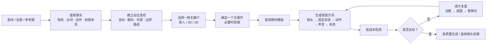

<div align="center">

# AI 视频分镜导演 · Prompt Engineering Kit

### 把模糊的画面想法，变成短、准、可执行的 5–15 秒 AI 视频镜头

**面向文生视频与图生视频的中文分镜、提示词、连续性控制与成片复盘工作流。**

[快速开始](#快速开始) · [模板库](#模板库) · [工作流](#导演工作流) · [质量验收](#质量验收) · [资料来源](#资料来源)

</div>

---

> [!TIP]
> **好视频提示词不是形容词的堆叠，而是一份能被模型执行的镜头调度。**  
> 本项目用导演思维锁定“谁、在哪里、做什么、镜头如何看、最后停在哪里”，让生成结果更接近预期，也更容易连续迭代。

## 为什么需要这套方法？

AI 视频最常见的失控，并不来自“创意不够酷”，而来自镜头信息不够明确：角色切镜后换边、站着的人突然坐下、道具换手、特效脱离动作、真人质感滑向游戏 CG、台词被改写，或 15 秒里同时塞入太多事件。

这套工具包将这些高频问题拆成可以检查、可以修正的控制点。它尤其适合：

- 为短剧、广告、UGC、动作、仙侠、科幻、动画等题材写可直接复制的视频提示词；
- 将剧本拆成连续镜头，并让下一镜可靠承接上一镜的末态；
- 用参考图、首尾帧或关键帧稳定角色、构图与场景；
- 针对已生成的视频做**先证据、后归因、再替换句**的复盘，而不是盲目重写；
- 在不同视频模型之间保留稳定的“内容层”表达，再补充平台特有参数。

## 核心能力

| 能力 | 项目如何处理 | 带来的结果 |
| --- | --- | --- |
| **单镜单事件** | 15 秒只保留一个主要戏剧事件，控制动作节拍与切镜数量 | 叙事更清楚，模型更容易完成 |
| **空间连续性** | 用画面坐标、朝向、姿态、手部、边界、路线与末态建立“站位圣经” | 减少串位、换边、换手与姿态漂移 |
| **媒介一致性** | 真人实拍、3D 动画、2D 动画三选一，再按题材细化 | 避免真人、动漫、游戏 CG 混成一团 |
| **动作驱动 VFX** | 按“发力 → 源头 → 作用 → 物理反馈 → 收束”描述特效 | 特效有因果、有重量、不抢戏 |
| **台词与声音控制** | 明确唯一允许台词、说话人、普通话、口型与声音禁项 | 少改词、少抢词、少莫名旁白 |
| **成片复盘** | 先保留正确项，再定位错误、成因和替换指令 | 每一次迭代都有方向，而非推倒重来 |

## 导演工作流



### 1. 先锁空间，再写镜头

多人对话、对峙、救援、打斗，或含有门、桌、车辆、台阶、阵法等边界的画面，先建立以下信息：

```text
画面坐标 → 面向 / 视线 → 高度与姿态 → 不可跨越边界
→ 持物手 → 移动路线 → 本镜末态
```

其中，“画面左 / 右”指观众所见的画面坐标，必须与角色自身的左右手严格区分。除非提示词明确要求移动，否则角色默认原地不动；近景与反打只改变摄影机，不改变人物真实位置。

### 2. 让 15 秒只讲一件事

一次发现、一次谈判、一次威胁、一次攻击、一次治疗、一次离场——一条短片优先承载其中之一。建议只保留：**一个主机位逻辑、2–3 个动作节拍、一个主要特效结果**。

开场空间重要时，第一镜须用全景或中全景确认人数、距离、边界与姿态；近景无法替代空间证明。

### 3. 用可观察的动作替代抽象形容词

不要只写“紧张地靠近”。请写：`向左后方退半步并停住，右手持续持物，左手完成其余动作。`

一个稳定的短提示词通常按此顺序组织：

```text
媒介与镜头 → 固定站位 / 身份 → 唯一动作 → 摄影机 → 对白 / 声音 → 末态 → 必要禁项
```

## 快速开始

### 场景 A：从一句剧本开始

将创意、剧本或画面意图交给 `ai-video-director`，并说明你希望生成单镜还是连续分镜。

```text
使用 $ai-video-director：
为一段 15 秒真人都市短剧写可直接复制的视频提示词。

剧情：深夜办公室里，女主站在门边，男同事隔着会议桌说“别走，我还有一句话”。
要求：两人始终隔着桌子；女主不转身离开；无配乐、无字幕；最后停在紧张的对视。
```

你将得到一份聚焦于**固定空间关系、唯一表演事件、摄影机、唯一台词与末态**的中文提示词，而不是难以执行的长篇散文。

### 场景 B：用参考图做图生视频

参考图已经锁定人物外观、构图与基础光线时，文本不应反复描写这些已知信息。重点只写：

```text
谁动 → 怎么动 → 摄影机怎么动 → 哪些关系绝不能变 → 最后一帧是什么
```

连续镜头可将上一镜末帧或站位图作为下一镜输入；建议先用低成本短测试验证身份、动作与位置，再生成高质量版本。

### 场景 C：复盘一条已生成视频

若目标是检查而非重写，使用成片复盘模板。交付按以下顺序进行：

1. 保留项：哪些人物、站位、动作或声音正确；
2. 错误：按严重度标记时间段和错误事实；
3. 成因：原提示词中哪一句缺失、含混或冲突；
4. 替换指令：给一段可直接粘贴的短句；
5. 下一版策略：拆镜、补全景、换参考帧或缩减动作。

这能避免“看起来不对”却找不到修改入口的反复试错。

## 模板库

仓库提供 13 份可直接复制、可按需填写的中文模板。先选择**一种主媒介**，再选择题材模板。

| 场景 | 模板 | 设计重点 |
| --- | --- | --- |
| 通用单镜 | [`00-通用短提示词`](templates/00-通用短提示词.txt) | 固定状态、唯一动作、末态 |
| 真人剧情 / 对话 | [`01-真人剧情对话`](templates/01-真人剧情对话-15秒.txt) | 真实表演、口型与不跨轴反打 |
| 真人动作 / VFX | [`02-真人动作VFX`](templates/02-真人动作VFX-15秒.txt) | 真实重心、受力与动作驱动特效 |
| 仙侠 / 玄幻 | [`03-仙侠玄幻`](templates/03-仙侠玄幻-15秒.txt) | 真人仙侠与 3D 仙侠的明确分流 |
| 3D 家庭动画 | [`04-3D家庭动画`](templates/04-3D家庭动画-15秒.txt) | 可信角色表演与稳定材质 |
| 2D 动画 | [`05-2D动画`](templates/05-2D动画-15秒.txt) | 统一线条、上色与逐帧运动逻辑 |
| 都市短剧 | [`06-都市短剧`](templates/06-都市短剧-15秒.txt) | 关系、表演、空间边界与台词 |
| 广告 / 产品 | [`07-广告产品`](templates/07-广告产品-15秒.txt) | 单一卖点、产品稳定性与品牌末帧 |
| UGC / 社媒 | [`08-UGC社媒`](templates/08-UGC社媒-15秒.txt) | 手机实拍感、自然口语与单一钩子 |
| 科幻 / 赛博 | [`09-科幻赛博`](templates/09-科幻赛博-15秒.txt) | 装置因果、空间边界与媒介分流 |
| 惊悚 / 恐怖 | [`10-惊悚恐怖`](templates/10-惊悚恐怖-15秒.txt) | 信息控制与有限、清楚的危险变化 |
| 自然 / 纪录片 | [`11-自然纪录片`](templates/11-自然纪录片-15秒.txt) | 克制观察、真实环境与自然行为 |
| 转场 / 首尾帧 | [`12-转场首尾帧`](templates/12-转场首尾帧-15秒.txt) | 一个连续、可解释的视觉桥接动作 |
| 成片检查 | [`99-成片复盘`](templates/99-成片复盘输出.txt) | 保留项 → 错误 → 成因 → 替换句 |

完整的题材选择建议见 [风格路由与模板索引](references/03-风格路由与模板索引.md)。

## 支持的创作输入

| 你手上有什么 | 推荐起点 | 关键注意事项 |
| --- | --- | --- |
| 一句创意或剧本 | 通用模板 + 对应题材模板 | 先抽取角色、唯一台词、动作先后与离场结果 |
| 多人连续剧情 | 15 秒分镜工作流 + 连续性清单 | 每镜建立开场状态和末态，不让对话自动变成换位 |
| 参考图 / 角色资产 | 平台与输入适配 | 不重复描述图片已有内容，集中写运动与不可变关系 |
| 上一镜末帧 | 转场模板 + 站位圣经 | 让前镜末态成为后镜开场事实 |
| 已生成的视频 / 截图 | 成片复盘模板 | 先复盘，再决定是否重写完整提示词 |

## 质量验收

生成前和交付前，请按这个顺序检查。越靠前的项目，越应优先修正：

- [ ] **影像类型**：真人实拍、2D 动画、3D 动画是否只选了一种？
- [ ] **人数与身份**：是否锁定总人数、角色身份与不可出现的额外角色？
- [ ] **空间关系**：画面坐标、距离、朝向、视线、桌门车等边界是否清楚？
- [ ] **姿态与手部**：站 / 坐 / 跪、双脚承重、左右手和持物是否连续？
- [ ] **主动作**：本镜是否只发生一个主要事件？
- [ ] **特效因果**：特效是否从角色或装置动作的明确源头产生，并反馈到环境？
- [ ] **声音与文字**：唯一台词、说话人、口型、旁白 / 音乐 / 字幕 / 水印禁项是否明确？
- [ ] **末态衔接**：最后一帧是否能直接作为下一镜开场？

对真人实拍项目，建议额外验证真实皮肤、呼吸、重心、脚步、衣物受力、景深、运动模糊与 VFX 合成感；不要只写“电影感”。更完整的故障归因表见 [连续性、真人感与成片复盘](references/02-连续性与成片复盘.md)。

## 项目结构

```text
.
├── SKILL.md                         # AI 视频分镜导演的完整工作规范
├── agents/
│   └── openai.yaml                  # Agent 展示信息与默认调用提示
├── references/
│   ├── 01-15秒分镜工作流.md          # 剧本到连续镜头的拆解方式
│   ├── 02-连续性与成片复盘.md        # 连续性清单、常见失败与纠错
│   ├── 03-风格路由与模板索引.md      # 题材与媒介选择
│   ├── 04-平台与输入适配.md          # 文生 / 图生、声音、负面提示适配
│   └── 05-调研来源与结论.md          # 可迁移方法的来源与项目经验
└── templates/                       # 13 份可填写、可复制的中文模板
```

## 设计原则与边界

- **短而精准**：优先用可观察的动作和结果描述画面，不用华丽但含混的形容词填满提示词。
- **先结构，后风格**：空间关系、动作因果与末态确定后，再加题材与视觉风格。
- **按平台适配，而非死记参数**：不同模型对音频、负面提示、参考图与长时长支持不同；本项目保留可迁移的内容结构，平台参数应以实际文档为准。
- **不假装一条解决整场戏**：多人台词、多轮打斗、多段转场和多次高潮，应拆为可连续衔接的镜头。
- **不把具体工作室风格当成可复制标签**：需要家庭向 3D 气质时，使用通用、可描述的视觉特征，而不是声称复刻某家工作室。

## 资料来源

本项目将实战中的高频问题沉淀为验收规则，并参考了 OpenAI、Runway、Google Cloud、阿里云等公开指南，以及开源提示词资料库中可迁移的做法。完整链接与每项结论均记录在 [调研来源与可迁移结论](references/05-调研来源与结论.md)。

本 README 的信息架构亦借鉴了优秀开源维护者常用的做法：首屏清楚说明项目价值，紧随可验证的能力边界、快速开始与可探索的目录入口。GitHub 官方也建议 README 优先说明项目用途、上手方式和获得帮助的渠道；相关说明可见 [GitHub Docs：完善项目展示](https://docs.github.com/en/account-and-profile/tutorials/using-your-github-profile-to-enhance-your-resume)。

## 贡献与反馈

欢迎用真实案例推动模板演进。提交 Issue 或 PR 时，建议附上：

1. 创作目标与使用的平台；
2. 原始提示词（可脱敏）；
3. 参考图 / 首尾帧 / 成片截图（如有）；
4. 观察到的错误和出现时间段；
5. 你期望保持不变的角色、空间或声音关系。

这样每一次反馈都能沉淀成可复用的控制规则，而不仅是一条孤立的“灵感 prompt”。

---

<div align="center">

**把每一条提示词，当作一份小型的拍摄计划。**  
从“想要一个很酷的画面”，走向“我知道这一镜会如何开始、如何发生、如何结束”。

</div>
